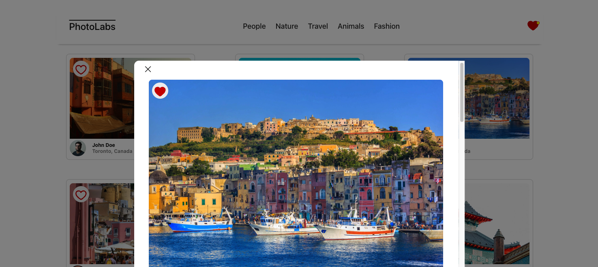

# react-photolabs
PhotoLabs is a full-stack web application developed during Lighthouse Labs' Web Development Bootcamp. This project served as an entry point into the realm of React, utilizing a basic application skeleton to craft a functional app, with a primary focus on mastering state management.

# Photolabs
PhotoLabs is fueled by NodeJs, ExpressJs, PostGreSQL, and ReactJs. It's meant to simulate a photo-sharing platform where users can favourite photos, explore detailed views upon clicking, and browse photos by topic.

# Screenshots
#### Home Page

#### 'Animals' Topic Section

#### Top of Modal

#### Bottom of Modal

## Setup

Install dependencies with `npm install` in each respective `/frontend` and `/backend`.

## [Frontend] Running Webpack Development Server

```sh
cd frontend
npm start
```

## [Backend] Running Backend Servier

Read `backend/readme` for further setup details.

```sh
cd backend
npm start
```
